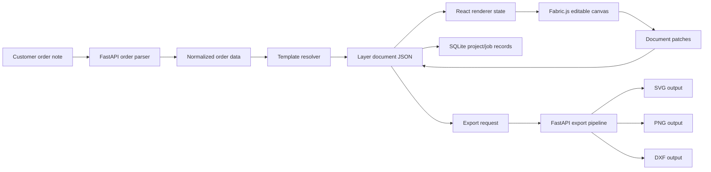

# New Version Architecture

## Scope

This document defines the target architecture for the next version of the
order-driven material generation editor. It is a design document only; it does
not define implementation code.

Target stack:

- Electron desktop shell.
- React + TypeScript renderer.
- Fabric.js canvas editor.
- Python FastAPI local backend.
- JSON template and layer model.
- SQLite for local project and job records.
- fontTools for font scanning.
- SVG, PNG, and DXF export pipeline.

## Architecture Principles

- The layer document JSON is the source of truth for saved designs.
- React UI state, Fabric.js object state, and export state must remain separate.
- Fabric.js is limited to canvas editing and viewport interaction.
- FastAPI owns deterministic business logic: parsing, template application,
  asset resolution, font scanning, persistence, and export orchestration.
- Production export must never include selection boxes, guides, handles, debug
  rectangles, hover states, or other editor-only objects.
- Text, SVG, and vector layers stay editable during editing. Rasterization is
  allowed only in the explicit export stage when required by the target format.
- File I/O must validate paths and block traversal outside approved workspace,
  template, asset, font, and output directories.
- Order parsing may use heuristics, but template application and export must be
  deterministic and testable.

## Folder Structure

```text
apps/
  desktop/
    package.json
    electron/
      main/
        main-process entry
        backend process supervisor
        app menu and native dialogs
      preload/
        typed bridge exposed to renderer
    src/
      renderer/
        app/
          app shell, routing, providers
        api/
          typed FastAPI client
          request and error adapters
        canvas/
          Fabric canvas host
          layer hydration and serialization
          selection and viewport tools
          editor-only overlays
        components/
          reusable UI components
        features/
          orders/
          templates/
          projects/
          jobs/
          exports/
          fonts/
          assets/
        state/
          React stores for UI/session state
        styles/
          global styles and design tokens

services/
  api/
    pyproject.toml
    app/
      main.py
      api/
        routes/
          health
          projects
          jobs
          orders
          templates
          documents
          assets
          fonts
          exports
      domain/
        orders/
          parser and normalized order models
        templates/
          template validation and application
        documents/
          layer document validation
        fonts/
          font scanning, glyph coverage, glyph mapping
        exports/
          export scene planning and format policies
      infrastructure/
        db/
          SQLite connection and migrations
        files/
          safe path resolver and file store
        processes/
          background export jobs
      schemas/
        Pydantic request and response models
      tests/
        pytest unit and integration tests

packages/
  design-core/
    package.json
    src/
      document schema types
      template schema types
      export schema types
      API contract types
      validation fixtures

templates/
  product templates as JSON

assets/
  fonts/
  flowers/
  samples/
  exports/

docs/
  architecture, export pipeline, font handling, refactor notes
```

## Data Flow



Runtime flow:

1. Electron starts the desktop shell and supervises the local FastAPI backend.
2. The renderer calls `/health` until the backend is ready.
3. Projects and jobs are loaded from SQLite through FastAPI endpoints.
4. The user enters or imports an order note.
5. The backend parses the order into normalized structured fields and warnings.
6. The renderer lets the user choose or confirm a product template.
7. The backend applies the template and produces a serializable layer document.
8. The renderer hydrates the layer document into Fabric objects for editing.
9. User edits are converted back into layer document patches or full document
   saves.
10. Export requests send document id, export options, and target formats to the
    backend.
11. The backend resolves assets and fonts, builds an export scene, writes output
    files, and records export status in SQLite.

## SQLite Data Model

SQLite stores local project and job records. The renderer never reads SQLite
directly.

Recommended tables:

- `projects`: local project metadata, display name, created/updated timestamps.
- `jobs`: order id, project id, template id, status, document id, export status.
- `documents`: serialized layer document JSON, schema version, checksum.
- `templates_cache`: discovered template ids, versions, validation status.
- `assets`: indexed local asset records, relative path, type, checksum.
- `fonts`: scanned font records, family, style, path, coverage summary.
- `exports`: export job status, requested formats, timestamps, error code.
- `export_files`: output file records, format, relative path, checksum, metadata.
- `settings`: local app preferences that are not part of export documents.
- `audit_events`: non-sensitive operational events for debugging.

Order notes may contain customer data. Store the original note only when needed
for the job workflow, and never write raw order text into logs.

## Layer Document Schema

The layer document is the saved design model. It is portable JSON and should be
shared between the renderer, backend, and tests through `packages/design-core`.

Pseudo-schema:

```jsonc
{
  "schemaVersion": "1.0",
  "documentId": "doc_...",
  "projectId": "project_...",
  "jobId": "job_...",
  "metadata": {
    "orderId": "order_...",
    "templateId": "template_...",
    "templateVersion": "1.0.0",
    "appVersion": "0.0.0",
    "createdAt": "ISO-8601 timestamp",
    "updatedAt": "ISO-8601 timestamp"
  },
  "canvas": {
    "width": 3000,
    "height": 3000,
    "unit": "px",
    "background": {
      "type": "solid",
      "color": "#ffffff"
    }
  },
  "layers": [
    {
      "id": "layer_...",
      "type": "text | image | svg | path | group",
      "name": "Customer name",
      "visible": true,
      "locked": false,
      "exportable": true,
      "zIndex": 10,
      "opacity": 1,
      "transform": {
        "x": 0,
        "y": 0,
        "width": 100,
        "height": 40,
        "rotation": 0,
        "scaleX": 1,
        "scaleY": 1
      },
      "slotId": "template slot id when bound",
      "tags": ["customer-text"]
    }
  ],
  "bindings": [
    {
      "slotId": "name",
      "source": "order.customerName",
      "layerId": "layer_..."
    }
  ],
  "assets": [
    {
      "assetId": "asset_...",
      "kind": "font | image | svg",
      "path": "safe relative asset path",
      "checksum": "sha256"
    }
  ]
}
```

Layer-specific payloads:

- Text layer:
  - `text`: editable string.
  - `fontRef`: family, style, weight, local font id, fallback font ids.
  - `style`: font size, fill, stroke, alignment, line height, letter spacing.
  - `layout`: text box, fit mode, overflow policy.
  - `glyphRuns`: optional explicit glyph substitutions and private-use mappings.
  - `exportPolicy`: preserve text for SVG/PNG, convert to paths for DXF.
- Image layer:
  - `assetRef`: local asset id and safe relative path.
  - `sourceType`: raster image.
  - `fit`: contain, cover, stretch, or fixed.
  - `intrinsicSize`: source width and height.
- SVG layer:
  - `assetRef` or inline sanitized SVG reference.
  - `preserveVector`: true by default.
  - `viewBox` and parsed bounds.
- Path layer:
  - `pathData`: normalized vector path data.
  - `fill`, `stroke`, `strokeWidth`, `windingRule`.
- Group layer:
  - `children`: ordered child layer ids or embedded child layers.
  - `clipPath`: optional path reference.

Editor session state is not part of the export document. Selection, zoom, pan,
active tool, snap guides, hover state, context menus, and debug overlays belong
in renderer session state only.

## Template Schema

Templates describe product-specific defaults and constraints. They do not store
customer-specific edits.

Pseudo-schema:

```jsonc
{
  "schemaVersion": "1.0",
  "templateId": "birth-flower-card",
  "version": "1.0.0",
  "productType": "custom material",
  "displayName": "Birth flower card",
  "canvas": {
    "width": 3000,
    "height": 3000,
    "unit": "px",
    "background": "#ffffff"
  },
  "slots": [
    {
      "slotId": "customer_name",
      "kind": "text",
      "required": true,
      "defaultLayer": {
        "type": "text",
        "transform": {
          "x": 500,
          "y": 500,
          "width": 1000,
          "height": 200
        },
        "fontRef": {
          "family": "Configured font family"
        }
      },
      "binding": {
        "source": "order.customerName",
        "fallback": ""
      },
      "constraints": {
        "maxCharacters": 80,
        "overflow": "shrink-to-fit"
      }
    }
  ],
  "assetRules": [
    {
      "slotId": "flower",
      "source": "order.birthMonth",
      "resolver": "local asset table key"
    }
  ],
  "fontRules": [
    {
      "slotId": "customer_name",
      "requiredGlyphCoverage": "text value after parsing",
      "fallbackPolicy": "warn-and-fallback"
    }
  ],
  "exportPolicy": {
    "formats": ["svg", "png", "dxf"],
    "png": {
      "scale": 1,
      "background": "canvas"
    },
    "svg": {
      "preserveText": true,
      "preserveVector": true
    },
    "dxf": {
      "textMode": "paths"
    }
  }
}
```

Template validation must check:

- Schema version support.
- Required slots and unique slot ids.
- Canvas size and unit validity.
- Asset references and resolver keys.
- Font rules and fallback availability.
- Export policy compatibility with layer kinds.

## API Endpoints

All endpoints return JSON. Errors use the shared error envelope described below.

| Method | Path | Purpose |
| --- | --- | --- |
| `GET` | `/health` | Backend readiness check. |
| `GET` | `/api/app/status` | Backend version, data paths, feature flags. |
| `GET` | `/api/projects` | List local projects. |
| `POST` | `/api/projects` | Create a local project. |
| `GET` | `/api/projects/{projectId}` | Read project details. |
| `PATCH` | `/api/projects/{projectId}` | Update project metadata. |
| `GET` | `/api/jobs` | List jobs, optionally filtered by project/status. |
| `POST` | `/api/jobs` | Create a job from order metadata. |
| `GET` | `/api/jobs/{jobId}` | Read job status and linked document/export state. |
| `PATCH` | `/api/jobs/{jobId}` | Update job metadata or workflow status. |
| `POST` | `/api/orders/parse` | Parse customer order text into normalized fields. |
| `GET` | `/api/templates` | List available templates. |
| `GET` | `/api/templates/{templateId}` | Read a template. |
| `POST` | `/api/templates/validate` | Validate a template JSON document. |
| `POST` | `/api/documents/from-template` | Apply parsed order data to a template. |
| `GET` | `/api/documents/{documentId}` | Read a layer document. |
| `PUT` | `/api/documents/{documentId}` | Replace a saved layer document. |
| `PATCH` | `/api/documents/{documentId}` | Apply document patch operations. |
| `POST` | `/api/documents/{documentId}/validate` | Validate a layer document. |
| `GET` | `/api/assets` | List indexed assets. |
| `POST` | `/api/assets/scan` | Scan approved asset directories. |
| `POST` | `/api/assets/resolve` | Resolve template/order asset references. |
| `GET` | `/api/fonts` | List scanned fonts. |
| `POST` | `/api/fonts/scan` | Scan approved font directories using fontTools. |
| `GET` | `/api/fonts/{fontId}/glyphs` | Return glyph coverage and metadata. |
| `POST` | `/api/fonts/{fontId}/glyphs/resolve` | Resolve text to glyph coverage and substitutions. |
| `POST` | `/api/exports/preview` | Validate export readiness without writing final files. |
| `POST` | `/api/exports` | Start SVG/PNG/DXF export job. |
| `GET` | `/api/exports/{exportId}` | Read export status, errors, and output records. |
| `GET` | `/api/exports/{exportId}/files/{fileId}` | Download or open a generated output file. |

Endpoint boundaries:

- Route handlers should validate requests and delegate to domain services.
- Domain services should not import Electron or React concepts.
- Renderer code should use a typed API client instead of raw ad hoc fetch calls.
- Long exports should run as jobs with status polling, not blocking UI calls.

## Export Pipeline

The export pipeline converts an editable layer document into target output
formats without mutating the saved document.

Stages:

1. Load document, project, job, template, assets, and font records.
2. Validate schema version, required metadata, layer bounds, layer order, and
   export policy.
3. Resolve asset paths through the safe path resolver.
4. Resolve fonts and glyph coverage through scanned font records.
5. Build an export scene from exportable layers only.
6. Remove editor-only state and reject any layer tagged as overlay/debug/handle.
7. Normalize transforms, bounds, opacity, clipping, and z-order.
8. Emit each requested format.
9. Write metadata and output file records.
10. Persist export status, checksums, warnings, and recoverable errors.

SVG export:

- Preserve SVG and path layers as vector data whenever possible.
- Preserve text as text when the export policy allows it and font references are
  valid.
- Convert text to paths only when explicitly requested or required by a target
  workflow.
- Embed or reference metadata: template id, order id, timestamp, app version,
  document id, and export id.

PNG export:

- Render from the export scene, not the live Fabric editor viewport.
- Apply requested scale, transparent/solid background policy, and output size.
- Fail explicitly on missing required assets or fonts.
- Never include selection boxes, guides, handles, or debug layers.

DXF export:

- Accept path-like geometry only.
- Convert text and glyph runs to paths before DXF generation.
- Flatten unsupported SVG constructs into paths or return a structured
  unsupported-layer error.
- Preserve product scale and units according to template/export policy.

## Font And Glyph Handling

fontTools is the backend authority for font metadata.

Responsibilities:

- Scan approved font directories.
- Extract family, subfamily, full name, PostScript name, style, weight, and file
  checksum.
- Build glyph coverage indexes by Unicode code point and glyph name.
- Detect private-use glyphs and non-standard cmap behavior.
- Resolve template text to available glyphs before export.
- Return explicit warnings for missing glyphs, fallback usage, and substitutions.

Renderer responsibilities:

- Display selected font family and warning state.
- Avoid guessing glyph availability from browser font rendering alone.
- Use backend glyph resolution before final export.

## Error Handling Strategy

Every backend error response uses a structured envelope:

```jsonc
{
  "error": {
    "code": "FONT_LOAD_FAILED",
    "message": "Human-readable summary",
    "details": {
      "field": "fontId",
      "reason": "Font file could not be parsed"
    },
    "traceId": "trace_...",
    "recoverable": true
  }
}
```

Core error codes:

- `VALIDATION_ERROR`
- `UNSUPPORTED_SCHEMA_VERSION`
- `PATH_TRAVERSAL_BLOCKED`
- `FILE_NOT_FOUND`
- `ASSET_NOT_FOUND`
- `ASSET_PARSE_FAILED`
- `TEMPLATE_INVALID`
- `ORDER_PARSE_FAILED`
- `FONT_LOAD_FAILED`
- `GLYPH_MISSING`
- `GLYPH_SUBSTITUTION_REQUIRED`
- `SVG_PARSE_FAILED`
- `EXPORT_UNSUPPORTED_LAYER`
- `EXPORT_FAILED`
- `DB_ERROR`
- `BACKEND_UNAVAILABLE`

Handling rules:

- Backend functions return structured errors; they do not silently drop failed
  layers, fonts, assets, or export steps.
- Recoverable warnings are attached to parse, document validation, and export
  preview responses.
- Fatal export errors stop the affected format and mark the export job failed or
  partially failed.
- The renderer maps errors to field-level messages, job-level banners, and export
  result panels.
- Logs may contain ids, codes, and paths after redaction. Logs must not contain
  raw customer order notes unless explicitly enabled for a debugging session.

## Testing Strategy

Frontend:

- Unit-test typed API client adapters and error mapping.
- Test React panels for empty project, missing template, missing asset, missing
  font, failed parse, failed save, and failed export states.
- Test Fabric hydration and serialization for text, image, SVG, path, group, and
  hidden layers.
- Test that editor-only overlays are not included in export requests.

Shared TypeScript package:

- Validate layer document and template fixtures.
- Keep contract fixtures compatible with backend Pydantic schemas.
- Add migration fixtures for future schema versions.

Backend:

- `pytest` parser tests for representative order notes and invalid inputs.
- Template engine tests for slot binding, required fields, defaults, constraints,
  and invalid template files.
- Font scanner tests for normal Unicode fonts, private-use glyph fonts, missing
  glyphs, corrupted files, and fallback behavior.
- Asset resolver tests for missing files, invalid SVG, unsupported images, and
  path traversal attempts.
- Export tests for SVG preservation, PNG dimensions/background, DXF path-only
  output, metadata inclusion, and failed format isolation.
- SQLite tests for project/job/document/export lifecycle and migration safety.

Integration:

- Start FastAPI locally and run renderer contract tests against it.
- Exercise full order-to-template-to-document-to-export flow with fixture assets.
- Add golden SVG snapshots and golden PNG image tests for critical templates.
- Add DXF structural snapshots for geometry and metadata.

Recommended verification commands:

- `pnpm lint`
- `pnpm test`
- `pnpm build`
- `pytest`
- `ruff check .`
- `mypy app`
- `pnpm --filter desktop build`

## Migration Phases

Phase 1: Stabilize contracts.

- Define `packages/design-core` schemas for layer documents, templates, API
  contracts, and export options.
- Add shared fixtures that both frontend and backend tests consume.
- Freeze the distinction between editor state and export state.

Phase 2: Introduce FastAPI domain services.

- Move order parsing, template application, font scanning, asset resolution, and
  export orchestration behind FastAPI endpoints.
- Keep route handlers thin and isolate business logic under `services/api/app/domain`.
- Add SQLite project/job/document/export records.

Phase 3: Build React/Fabric editor.

- Implement Electron shell and typed renderer API client.
- Hydrate layer document JSON into Fabric objects.
- Serialize Fabric edits back into layer document patches.
- Keep Fabric-specific state inside `apps/desktop/src/renderer/canvas`.

Phase 4: Replace legacy rendering/export paths.

- Route all exports through backend export jobs.
- Preserve SVG/vector data where possible.
- Use deterministic PNG rendering from export scene state.
- Convert DXF inputs to path-like geometry only.
- Add metadata and output records for every export.

Phase 5: Deprecate legacy modules.

- Mark old Tkinter UI, direct renderer export paths, global mutable canvas state,
  ad hoc glyph handling, and mixed parsing/rendering modules as legacy.
- Keep compatibility shims only where needed for migration fixtures.
- Remove legacy code after new UI, API, and export tests cover the same behavior.

## Non-Goals

- No cloud backend requirement.
- No direct SQLite access from the renderer.
- No production dependency additions without a specific design note.
- No implementation code in this document.
